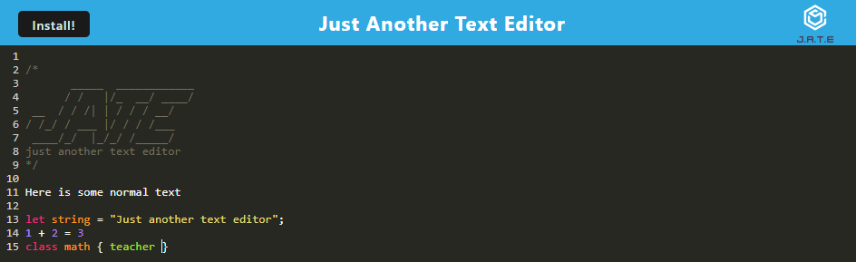

# Text Editor

## Description
Just Another Text Editor is an installable web application that one can edit text without the internet. 

## Table of Contents
- [Installation](#installation)
- [Usage](#usage)
- [Contributing](#contributing)
- [Contact](#contact)

## Installation
For devloper usage, download code from the GitHub repository. Have Node.js installed. Link to Node.js downloads: https://nodejs.dev/en/download/. Then in the terminal npm run install. The editor then will be ready if the user uses npm run start or npm run start:dev for localhost.

For anyone in the top left corner of the app, there is an install button which will install the app on the user's device. When pressed the application will be immediately opened.

## Usage
The user can create notes or code snippets with or without an internet connection. It will automatically save the changes to the loacl storages and the indexDB. This makes it so that the user can open the web app or the installed app and still have the same infomation. The text will be colored like coding editor so word like new and class will be colored differently. 

## Contributing
Author: Xandromus from the Rice Coding Bootcamp

March 18, 2022

Source code: JavaScript

repo link: https://github.com/coding-boot-camp/cautious-meme

Main npm packages (does not include all chack package.json in the main, client and server folder for mmore information):
- express - server
- if-env -environment variables
- code-mirror-themes - allows text editor to be colored like a coding editor
- idb -indexDatabase allows for local storage database
- webpack - module bundler to create PWAs (progressive web apps)
- babel - converts javascript to a uniform ECMA standard

## Contact
GitHub profile: https://github.com/CYMcolor

 
